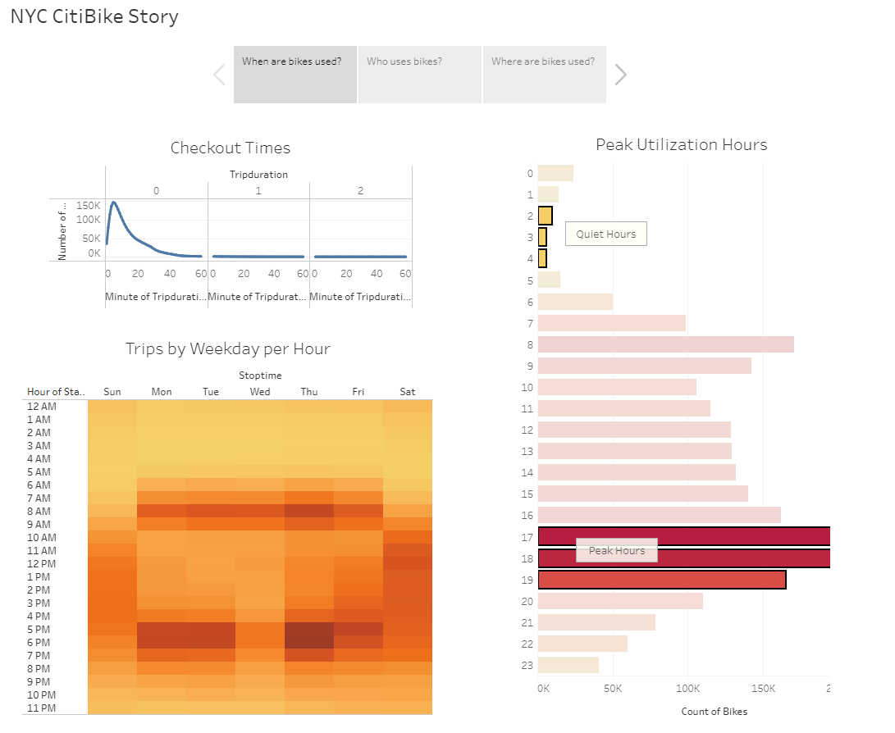

# NYC Bike Sharing Story

## Overview of Analysis
This analysis is going to be used to help convince investors that a similar idea for Des Moines is a solid proposal. The analysis is based on a bike sharing program which exists in New York City. This will help to demonstrate to stakeholders that this could also be a highly successful enterprise in Des Moines too.

## Results

# When are bikes used?
The first page in the story shows us which times are most popular and how long bikes are normally checked out for.
In the Checkout Times chart, we see that most rides are commonly around 10mins with the majority of rides under 30mins. In the Peak Utilization Hours we can see that the bikes are most commonly used between 5PM - 7PM, with the quietest hours between 2AM - 5AM. Finally, we can see that commute hours are busiest during the week while weekends have more usage during 10AM - 6PM.

# Who uses bikes?
This page details who exactly is using the bikes. We can see that most Subscribers are Male with predominant use Mon-Fri. However, customers are distributed equally between Female, Male and Unknown. Males account for at least two thirds of all 2,344,224 rides analyzed in August. Trips by Gender reinforces what we see in the other charts that Men are most likely to ride bikes during commute time or during the weekend. 

# Where are bikes used?
This final page shows where each of the bikes begin their journeys. While we can see that most are in lower Manhattan, we have to also take into account Tourist traffic which could have potential to increase pick ups from specific spots around landmarks in the City.

## Summary
Overall, the results show us that the highest utilization for Ride Sharing Bikes are used around commute times (early morning and early evening). The type of people who use the bikes the most are subscribers who are male. 

Some additional visualizations could be:
1. breaking down the demographics further to understand age brackets of riders.
2. bring in some city demographics to compare usage numbers with total population of city. 

[link to dashboard](https://public.tableau.com/app/profile/jerry8146/viz/BikeSharingStory_16333116376420/NYCCitiBikeStory "link to dashboard")